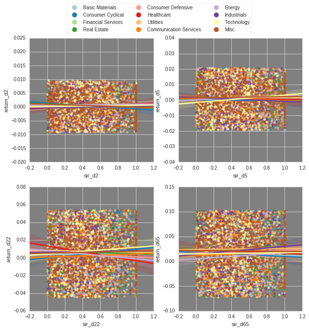
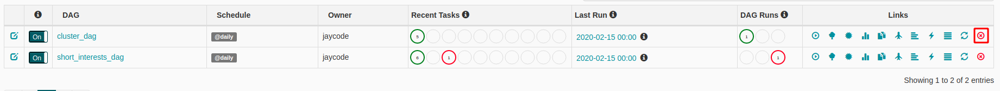
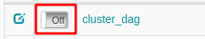
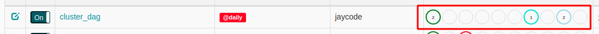
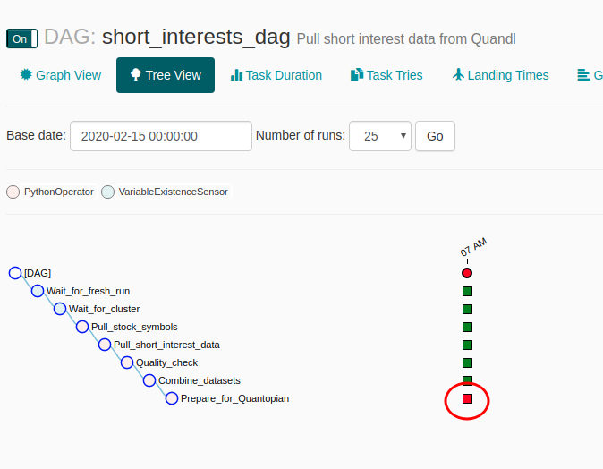
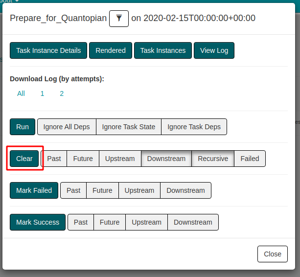

# Effect of Short Sale Volume to Stock Pricing - for Quantopian Self-Serve Data

Download FINRA short sale volume from Quandl, then process it to be uploaded to Quantopian Self-Serve Data.

## Overview

It has been commonly understood that a sizeable short interest may cause a stock's price to explode higher. How common is this knowledge, though? In this project, we create a data pipeline to periodically pull short interest data and stock pricing data and store them in an S3 server for future analysis.

The data pipeline is built on Apache Airflow, with Apache Spark + Hadoop plugin to pull the data and store them in a data lake on an S3 server (with Parquet format).

At the time of writing (2020-01-15), we have 3582 stocks from NASDAQ and 3092 stocks from NYSE. The earliest date is 2013-04-01, which accounts for nearly 1700 data points (261 working days each year). That means, we have more than 10 millions of data to process at max. At max, because many of the stocks won't have all of the days' data. Some of them may no longer exist. A complete run on 2020-02-05 returned approximately 6,798,996 rows of data (counted with `rdd.countApprox` function - see `4.validate_completed_data.ipynb` for the code).

To demonstrate that the pipeline works, we only use a small subset of the data, consisting of only 7 stocks configured in `airflow/config.cfg` file.

## Analysis Example

This is an example of an analysis we may perform with this dataset.

- The analysis was performed on the Quantopian Notebook environment.
- The data came from 2013-04-02 to 2020-02-10 (Y-m-d). I took the daily, 5 days, 22 days, and 65 days of returns (all of them are working days, and thus, in other words, they are daily, weekly, monthly, and 3-month returns) and took the short interest ratio at that date, that is short interest volume divided by total volume.
- From all the data above, I took 1000 sample data from each Morningstar sector. From there, I took the rows between 25% and 75% quantiles for each returns set (as such, there are 6000 data points in total)



As we have seen from the above visualizations, up until 1-month returns, short interests had some positive correlation with stock returns in the Technology sector. We also see interestingly an adverse correlation in the Healthcare stocks' returns.

For the 3-month returns, the highest positive effect was in the Industrials sector.

In other words, for stocks in the Healthcare industry, for instance, the visualization suggests that the higher the number of short interests a stock has, the lower its return in the next month, but not so much in the next 3 months.

This information might be useful for deciding whether to use short interest data to decide on which industry's stocks to go long and short with.

For future work, it might be interesting to see how the correlation changes in different periods. In addition to sector-based grouping, you may add time-based grouping e.g. according to business or political cycles.

## Steps

The pipeline consists of the following tasks:

1. **Cluster DAG** creates an Amazon EMR cluster, then waits for the other DAGs to complete.
2. If `STOCKS` configuration in `airflow/airflow.cfg` has not been filled with stock symbols, pull the list of stock information from 
   old NASDAQ links for both NYSE and NASDAQ exchanges. The links as follows:
    - NASDAQ: https://old.nasdaq.com/screening/companies-by-name.aspx?letter=0&exchange=nasdaq&render=download
    - NYSE: https://old.nasdaq.com/screening/companies-by-name.aspx?letter=0&exchange=nyse&render=download
3. Short Interest DAG, we will refer to this, and other non-cluster DAGs in the future, as **worker DAGs**: 
  - Pull short interest data from [Quandl's Financial Industry Regulatory Authority's short interest data](https://www.quandl.com/data/FINRA-Financial-Industry-Regulatory-Authority).
  - Store the data in the S3 server (or locally, depending on the setting in `config.cfg`).
  - Combine data from FINRA/NYSE and FINRA/NASDAQ exchanges (**Todo: There is also ORF and ADF exchanges, but I'm not sure where to get the list of stocks from. Can anybody help?**)

The pipeline is to be run once a day at 00:00. On the first run, it gets all data up to yesterday's date. On the following dates, we get one day of data for each day.


## How to set up and run

1. Create a key pair in the AWS EC2 console.
2. Create a CloudFormation stack from the `basic_network.yml` template. This is a generic VPC configuration with 2 private and 2 public subnets which should be quite useful for other similar projects too. I recommend setting the stack name with something generic, like "BasicNetwork". Take note of the first VPC ID and SubnetID of the first public subnet. **Todo: Find a way to combine this into the main CloudFormation stack in the next point and to remove unneeded subnets.**
3. Create a CloudFormation stack from `aws-cf_template.yml`. Pass in your Quandl key and AWS Access ID and Private Access Key. I would name this stack with a specific project's name like "ShortInterests".
4. After the stack created, go to the "Outputs" tab to get the URL of the Airflow admin, something like `http://ec2-3-219-234-248.compute-1.amazonaws.com:8080`. You can get the endpoint from there, which you can use to SSH connect.
    ```
    chmod 400 ~/path/to/airflow_pem.pem
    ssh -i "~/path/to/airflow_pem.pem" ec2-user@ec2-3-219-234-248.compute-1.amazonaws.com
    ```

5. Connect via ssh to the server. Note that the Airflow admin may likely not be ready just yet, because there may be some code that is still running on the EC2 server. To check on the progress, SSH-connect to the EC2 instance, then run this command `cat /var/log/user-data.log` to see the entire log, or `tail /var/log/user-data.log` to view the last few lines.

## How to kill the scheduler and webserver

To kill Airflow scheduler:

```
$ sudo kill $(ps -ef | grep "airflow scheduler" | awk '{print $2}')
```

To kill Airflow webserver:

```
$ cat $AIRFLOW_HOME/airflow-webserver.pid | sudo xargs kill -9
```

## FAQs

### How long does it take for a single run to download all short interest data?

Daily update should take about 1+ hour, with 35+ minutes for the gathering process of the short interest data.

If you are starting from a completely new database, I'm not quite sure how long it is going to take, since the project had undergone major changes from its initial version. Initially, it took about 20 minutes every 110,000 - 120,000 data points, so about a whooping 17 hours for the whole database. It is probably down to only a few hours now. **Todo: Update this section once we have the information.**

### Can I keep the EMR cluster after use?

By default, Cluster DAG turns off the EMR cluster after use or if there is an error in the Short Interests DAG. If you want to keep it on, create a Variable named `keep_emr_cluster` from the `Admin > Variables` menu at the top. This is useful for debugging, as it saves time rather than recreating the cluster all the time. Don't forget to delete the variable to avoid paying for unused cluster time.

### Where can I see the progress of the pulling process?

Click on the DAG's name, then on either Graph View or Tree View, click on the currently running task, then click on "View Log". You will need to keep refreshing and view the bottom of the page to check on the progress. **The status is updated every 5 minutes.**

### Can I resize the size of EMR? Will it affect the running speed?

Yes, No.

You may resize through the EMR cluster page, then click on Hardware. However, currently, changing it to anything above 3 nodes won't increase the speed of downloading short interest data. The bottleneck lies in the network connection between the EMR cluster's master node and Quandle or QuoteMedia server.

**Todo: Parallelization of the requests to Quandl by using UDF (user-defined-function) to perform GET requests through slave nodes may improve the speed of this process. The initial version of the code is stored in `airflow/dags/etl/pull_short_interests-udf.py`. It does not currently have any sort of reporting to tell us the progress as we pull the data, and, more critically, it creates duplicates for existing data.**

### What happens when the process got stopped in the middle?

The scheduler is smart enough not to re-process the data, so there is no worry here. However, the data are stored every after 100 requests, so some requests will need to be redone (should be okay however).

### Can I stop the EC2 server and re-run at later time?

Unfortunately, no. To stop the server, you currently need to delete the CloudFormation stack and re-upload the template for future re-runs. On the bright side, though, the system is designed to pick up from your previous state of the database, so it is okay to recreate the whole stack multiple times. **Todo: How do we update the code so EC2 server can be stopped and continued?**

### How do I debug the Short Interests DAG?

If there is an error on any of the steps in the Short Interests DAG, the system will do the following:

1. The DAG will stop running. Set the state of this worker DAG into ERROR.
2. The Cluster DAG will detect the state, then either:
  - By default, proceeds with turning off the EMR cluster (this is to avoid exorbitant charges from leaving it running).
  - If a Variable `keep_emr_cluster` exists, keep the EMR cluster.

Therefore, the final state is a SUCCESS state for the Cluster DAG and the ERROR state for the Short Interests DAG. To re-run only the step that contains the error, perform the following procedure:

#### 1. Delete the Cluster DAG

Click on the delete button on the right part of the Cluster DAG:



#### 2. Refresh the page, and then toggle ON the Cluster DAG

Click on this OFF switch to turn it on:



By doing so, the Cluster DAG will restart the EMR cluster and wait for the Short Interests DAG to complete (or returns another error).

#### 3. Wait until the Cluster DAG is in *waiting* state

The *waiting* state should look like so:



Take note of the colors and positions of the circles.

#### 4. Clear the task that contains the error

Click on the `short_interests_dag` link to open up its details, then click on "Tree View". Within it, click the red box (the task that contains the error):



Then click on the "Clear" button:



#### 5. ????

#### 6. Profit

Now we just need to wait for the Short Interests Dag to complete running.


## Other Scenarios

### 1. What if the data were increased by 100x?
The main problem is with pulling the data from the APIs. Each request takes about 3 seconds. To make this process faster, we can try adding more nodes in our EM3 cluster to deal with this situation.

### 2. What if we needed to run the pipeline on a daily basis by 7 am every day?
Update `schedule_interval` setting accordingly for all of the DAGs for this.

### 3. What to do if the database needed to be accessed by 100+ people?
The answer to this comes in two flavors:
- If the users need to flexibly access the database to perform any SQL queries, we opt for a Redshift cluster with auto-scaling capabilities.
- If the users would run basically a few sets of queries, use the combination of Apache Spark and Apache Cassandra to use the latter as a storage layer. [Here](https://opencredo.com/blogs/data-analytics-using-cassandra-and-spark/) is a link to a tutorial on this.


## Reasonings Behind Technologies Used

- Amazon EMR: Easy to scale up or shrink down, and we do not need to keep the server running all the time.
- Apache Airflow: Scheduler application. Another interesting alternative for this is AWS Step Functions, but for
  this project Apache Airflow is preferable as it is way easier to setup.
- Apache Spark: Good for working with huge datasets.

## Todos

1. A more comprehensive list of stock tickers is needed. Currently, the list of stock tickers are gathered from the Nasdaq's site, but it does not include stocks of closed or acquired companies. ARRY, for example, does not exist when the code was run on 2020-02-19, while Quantopian has this ticker.
2. Run the code to build an empty database, and update the **FAQ** to include this information.
3. There are a couple of **Todo**s above. If you feel generous, post a pull request to improve them.
4. The `aws-latest` branch is meant to gather pricing data from QuoteMedia then combine them with the short interest data from Quandl. However, the branch still currently has some bugs, and it does not make sense to combine the data for later slicing them off when preparing the data for use in Quantopian. When the need to analyze the data outside of Quantopian arises, work on this branch further.
5. The `local-only` branch is for the local version of Airflow. This was needed when the system was initially developed. I don't see how it is ever going to be needed again, but I keep this branch just in case someone may need it.
6. Both the `aws-latest` and `local-only` branches are currently not fast enough for use with large datasets. Diff the `airflow/etl/short_interests.py` with `quantopian-only` branch and move the needed updates to the other branches. Also, do similar updates to the `airflow/etl/pull_prices.py` file.
7. Investigate whether parallelization of the GET requests would improve the ETL speed (see the "FAQs" section above).
8. The `UserData` code in `aws-cf_template.yml` was made by trial-and-error. There are some redundant code like the AWS configure code and how Airflow scheduler cannot be created from the `ec2-user` (and therefore we can only shut it down with `sudo`). If you are a bash code expert, this code will certainly benefit from your expertise.
9. The CloudFormation stack currently has 2 public and 2 private subnets, while the scheduler only resides on a single public subnet. It took a lot of experiments to get to this working point so I did not improve this. If you are a CloudFormation expert, your assistance here would be totally appreciated.
